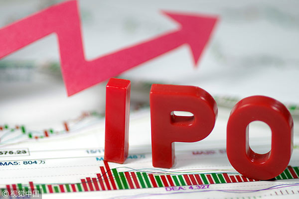

# IPO-Analysis

By Xinyao Wu

 
## Abstract

Investors are interested in predicting the Initial Public Offering (IPO) price. By analyzing on the historical records for companies raising capital from public investors by IPO, important indicators can be found and effective models can be trained for future prediction.

The dataset includes over 500 records among two sheets (U.S and China) in excel file. The features include numerical variables such as __Market capitalization of the company__, __Current value__ and __Date__, __P/E ratio of company__ and categorical variables such as __industry__, __CEO of company__, __Location__, __Sponsor__, __Lead Underwriter__, __Exchange company__, __Sell-hold-buy__.

## Objective 

1. Visualize the distribution of IPO companies  
2. Build prediction models for IPO price with machine learning methods  

## Methods

Tableau  
R  
Python  
Linear regression  
logistic regression  
SVM  
Random Forest  
Adaboost  

## Visualization

*	The top3 welcomed industries for initial public offering in China are: Information Technology, Building Decoration, Medical Biology. Those followed with Finance, Electronics, Real Estate, Light manufacturing, and car, which account for 50% of the total count of IPO in China.
*	In U.S., the IPO pool collects fewer industries. The dominant position was taken by Health Care, which accounts for nearly 40%.
*	For combination IPO counts of U.S. and China, effected by the dominant industry of U.S, healthcare has the most frequency. Thus, this trend cannot be utilized in China, based on the importance difference on healthcare industry. However, industries like IT and Financial, take important roles in both U.S. and China, which indicates the stable development of IPO in these industries.
 
 

*	Hong Kong Exchanges and Clearing Limited accounts for 39%, followed by NASDAQ, which takes 26 percentage of the total exchanges.
 
 

*	New York and San Francisco, Cambridge is the top3 city in U.S for IPO.
*	China performs better than U.S in terms of IPO based on location distribution of business.

*	Hong Kong, Beijing, Shanghai are the 3 hottest location for business in China.

## Analysis

### 1. Dataset

The original data names __*2018 IPO in China & US(final)*__ in data folder. However, unicode encoding issues exist in some strings in some text cells. So I cleaned the data with Excel and united the currency by __Vlookup__ in Excel. The cleaned data names __*2018 IPO_trans+pe*__.  

The analyses for China and U.S were conducted seperately.

### 2. Missing value

### 3. Feature engineering

### 4. Create models

### 5. Make predictions

